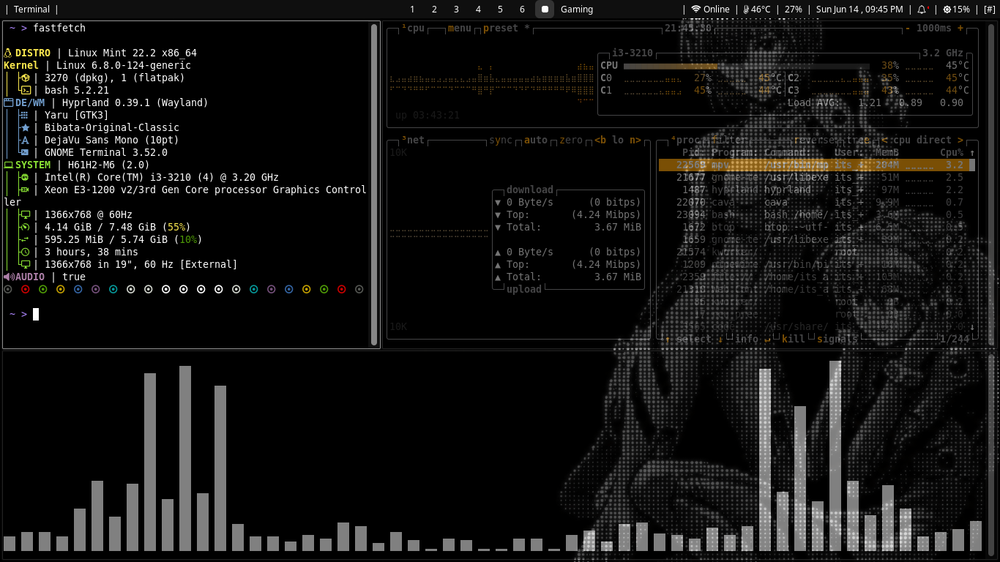
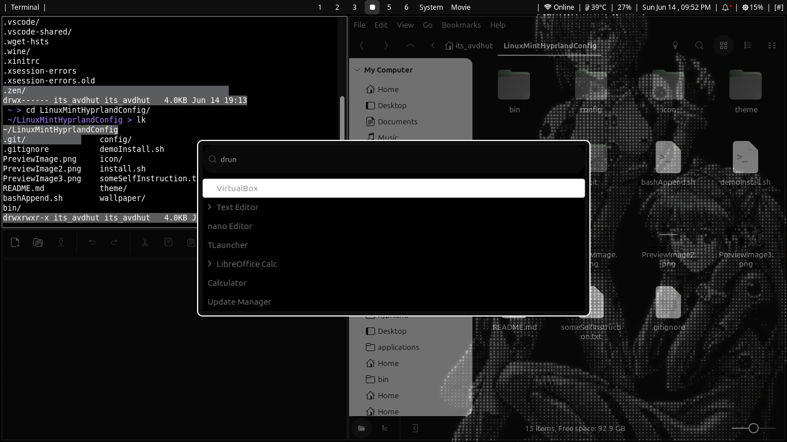
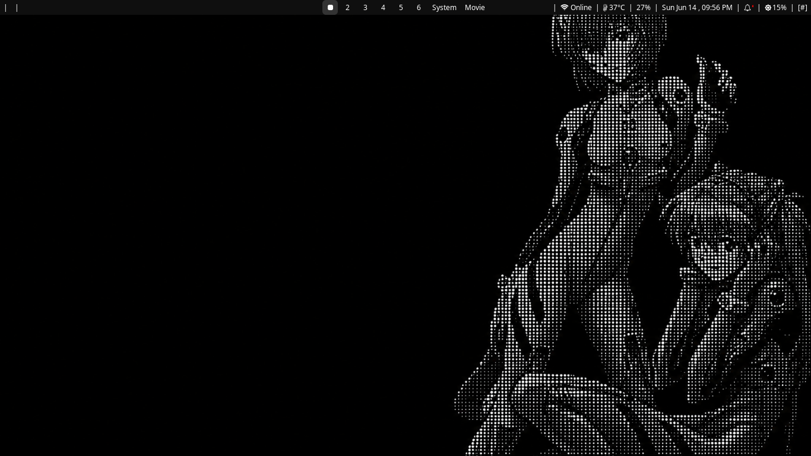

# LinuxMintHyprlandConfig

A personal dotfile repo for my Mint + Hyprland setup. Dark, minimal, and opinionated — don't expect things to be neatly organized.

---

> [!WARNING]
> This is built specifically for **Debian-based** systems — **Linux Mint** in particular — with **Hyprland** already installed.
> If you're on a different Debian-based distro, remove the `checkIfDebian` function call from `install.sh` before running it.

---
# Installing Hyprland on Linux Mint

<details>
<summary><b>Installation steps</b></summary>


This guide covers installing the Hyprland Wayland compositor on Linux Mint using an automated script.

> [!NOTE]
> **Credits:** This setup uses the automation scripts and configurations maintained by **JaKooLit**. Consider starring the original repo to support the developer.
>
> **Original Repository:** [JaKooLit/Ubuntu-Hyprland](https://github.com/JaKooLit/Ubuntu-Hyprland)

---

## Step 1: Prepare System Dependencies

Update your package lists and install the core utilities needed for cloning and building.

```bash
sudo apt update && sudo apt upgrade -y
sudo apt install git make cmake -y
```

## Step 2: Identify Your Mint Version Base

Linux Mint releases are built on top of specific Ubuntu LTS bases. Target the branch that matches your version:

- **Linux Mint 22** → based on **Ubuntu 24.04**
- **Linux Mint 21 (21.1, 21.2, 21.3)** → based on **Ubuntu 22.04**

## Step 3: Clone the Correct Branch

### For Linux Mint 22:

```bash
cd ~
rm -rf Ubuntu-Hyprland
git clone -b 24.04 --depth 1 https://github.com/JaKooLit/Ubuntu-Hyprland.git
```

### For Linux Mint 21:

```bash
cd ~
rm -rf Ubuntu-Hyprland
git clone -b 22.04 --depth 1 https://github.com/JaKooLit/Ubuntu-Hyprland.git
```

## Step 4: Run the Installer

Navigate into the cloned directory, make the installer executable, and run it.

```bash
cd Ubuntu-Hyprland
chmod +x install.sh
./install.sh
```

## Step 5: Follow the Interactive Prompts & Reboot

The setup menu will guide you through the process:

1. Enter your `sudo` password when prompted.
2. Choose options matching your hardware — especially if you're on an **Nvidia** GPU.
3. Select additional features like Waybar or custom GTK themes.
4. Reboot once complete.

## Step 6: Log Into Hyprland

1. On the Linux Mint login screen, select your username.
2. Click the session icon (usually a small gear near the password field).
3. Select **Hyprland** from the list.
4. Enter your password and log in.

---

### Additional Resources

- [How to Install Hyprland on Ubuntu + Linux Mint (Video Guide)](https://youtube.com)

</details>

---
# Installation
<b>recommended</b> to install after your in a hyprland session or after you install hyprland 
## Quick Start

```bash
# 1. Clone the repository
git clone https://github.com/yourusername/LinuxMintHyprlandConfig.git
cd LinuxMintHyprlandConfig

# 2. Run the install script
chmod +x install.sh
./install.sh

# 3. Follow the interactive prompts
```

## What `install.sh` Does

1. ✅ Creates symlinks for all configs → `~/.config/`
2. ✅ Creates symlinks for all scripts → `~/.local/bin/`
3. ✅ Installs GTK theme → `~/.themes/`
4. ✅ Sets GTK theme system-wide via `gsettings`
5. ✅ Asks for Automatic/Manual install of 
	1. Hyprshot  screenshots utility
	2. Walk terminal utility	
	3. Obsidian 
	4. Zen Browser
	5. VScode 

---
# GTK Theme

## Automatic

The install script handles this automatically. Nothing to do.

## Manual Installation

If you want to install the **Graphite-Dark** theme on its own:

```bash
mkdir -p ~/.themes
cp -r ./theme/gtkThemes/Graphite-Dark ~/.themes/
```

**Via Linux Mint GUI:**
1. Open **System Settings** → **Appearance** → **Themes**
2. Select **Graphite-Dark** from the GTK+ Theme dropdown

**Via command line:**
```bash
gsettings set org.cinnamon.desktop.interface gtk-theme "Graphite-Dark"
gsettings set org.gnome.desktop.interface gtk-theme "Graphite-Dark"
```

## Troubleshooting

**Theme not applying globally:**
```bash
gsettings reset org.cinnamon.desktop.interface gtk-theme
gsettings set org.cinnamon.desktop.interface gtk-theme "Graphite-Dark"
# Then log out and back in
```

**Reverting to default:**
```bash
gsettings reset org.cinnamon.desktop.interface gtk-theme
```

---
# Preview



---



---



---
# Wallpapers

<details>
  <summary>Wallpaper 1 — Full Blank Background</summary>
  <br>
  
</details>

<details>
  <summary>Wallpaper 2 — Dark Ocean Current</summary>
  <br>
  
</details>

<details>
  <summary>Wallpaper 3 — Classic Nokia Handshake</summary>
  <br>
  
</details>

<details>
  <summary>Wallpaper 4 — Solo Rei Ayanami</summary>
  <br>
  
</details>

<details>
  <summary>Wallpaper 5 — Rei and Asuka Manga Version</summary>
  <br>
  
</details>

---
# Hyprshot

Hyprshot is the screenshot utility used in this setup. It's integrated via these keybindings:

| Keybinding | Action |
|---|---|
| `Print` | Capture current monitor |
| `Super + Print` | Capture active window |
| `Shift + Print` | Capture region (drag to select) |

## Installation

The install script will prompt you automatically. Select option **1** to auto-install.

### Manual Installation

```bash
# 1. Clone
git clone https://github.com/Gustash/hyprshot.git ~/Hyprshot

# 2. Make executable
chmod +x ~/Hyprshot/hyprshot

# 3. Symlink
mkdir -p ~/.local/bin
ln -s ~/Hyprshot/hyprshot ~/.local/bin/hyprshot

# 4. Verify
hyprshot --help
```

If `hyprshot` isn't found after install, make sure `~/.local/bin` is in your 
PATH:

```bash
export PATH="$HOME/.local/bin:$PATH"
source ~/.bashrc
```

## Usage

```bash
hyprshot -m output    # capture monitor
hyprshot -m window    # capture window
hyprshot -m region    # capture region
hyprshot -m region -o ~/custom.png  # save to custom path
```

Screenshots are saved to `~/Pictures/Screenshots/` by default.

## Troubleshooting

**Command not found:**
1. `ls -l ~/.local/bin/hyprshot` — check symlink exists
2. `echo $PATH | grep .local/bin` — check PATH
3. Add `export PATH="$HOME/.local/bin:$PATH"` to `~/.bashrc` and re-source

**Screenshot save fails:**
```bash
mkdir -p ~/Pictures/Screenshots
chmod 755 ~/Pictures/Screenshots
```

**Keybinding not working:**
1. Check Hyprshot is installed: `command -v hyprshot`
2. Try the command directly: `hyprshot -m region`
3. Reload Hyprland: `Super + Escape` → log back in

## Uninstalling

```bash
rm ~/.local/bin/hyprshot
rm -rf ~/Hyprshot
```

---
### Resources

- [Hyprshot Repository](https://github.com/Gustash/hyprshot)
- [Hyprland Wiki — Bindings](https://wiki.hyprland.org/Configuring/Binds/)

---
# Walk

Walk is a terminal file manager that lets you navigate your filesystem interactively from the terminal. It's lightweight and fits well with a minimal Hyprland setup.

## What the install script does

1. Checks if `walk` is already installed — skips if found
2. Clones the repo to `~/walk`
3. Runs `~/walk/install.sh` which handles the build and binary placement itself

## Installation

The install script will prompt you automatically. Select option **1** to auto-install.

### Manual Installation

```bash
# 1. Clone
git clone https://github.com/antonmedv/walk.git ~/walk

# 2. Run the bundled install script
chmod +x ~/walk/install.sh
bash ~/walk/install.sh

# 3. Verify
walk --help
```

## Usage

```bash
walk          # open file browser in current directory
walk ~/docs   # open file browser at a specific path
cd $(walk)    # navigate and cd into the selected directory
```

## Uninstalling

```bash
rm -rf ~/walk
# also remove the binary if install.sh placed it somewhere on PATH
which walk && rm $(which walk)
```

---
### Resources

- [Walk Repository](https://github.com/antonmedv/walk)

---
# Obsidian

Obsidian is the note-taking app used in this setup. It's not available in apt repos so the install script downloads the `.deb` directly from GitHub releases.

A **Pitch Black** Obsidian theme is also bundled in this repo under `theme/Obsidian/pitchBlack/` — copy it into your vault to match the rest of the setup.

## What the install script does

1. Checks if `obsidian` is already installed — skips if found
2. Fetches the latest release version from the GitHub API
3. Downloads `obsidian_<version>_amd64.deb` to `/tmp/`
4. Installs it via `sudo apt install`
5. Cleans up the `.deb` from `/tmp/`

## Installation

The install script will prompt you automatically. Select option **1** to auto-install.

### Manual Installation

```bash
# 1. Go to https://obsidian.md/download and grab the .deb

# Or via curl (replace version number):
curl -L https://github.com/obsidianmd/obsidian-releases/releases/download/v1.5.12/obsidian_1.5.12_amd64.deb \
    -o /tmp/obsidian.deb

# 2. Install
sudo apt install -y /tmp/obsidian.deb

# 3. Clean up
rm /tmp/obsidian.deb

# 4. Verify
obsidian --version
```

## Applying the Bundled Pitch Black Theme

```bash
# copy the theme into your vault (replace YourVault with your vault name)
mkdir -p ~/YourVault/.obsidian/themes/
cp -r ./theme/Obsidian/pitchBlack ~/YourVault/.obsidian/themes/
```

Then inside Obsidian: **Settings → Appearance → Themes** → select **Pitch Black**.

## Uninstalling

```bash
sudo apt remove obsidian
```

---
### Resources

- [Obsidian Download Page](https://obsidian.md/download)
- [Obsidian Releases on GitHub](https://github.com/obsidianmd/obsidian-releases/releases)

---
# Zen Browser

Zen is a Firefox-based browser with a minimal, distraction-free UI. It's not in apt repos so the install script downloads and extracts the official tarball from GitHub releases.

## What the install script does

1. Checks if `zen` is already installed — skips if found
2. Downloads `zen.linux-x86_64.tar.xz` from the latest GitHub release to `/tmp/`
3. Extracts it to `~/zen-browser/` — kept in home so you can see where it lives
4. Creates a symlink: `~/zen-browser/zen` → `~/.local/bin/zen`
5. Cleans up the tarball from `/tmp/`

> [!NOTE]
> The browser lives at `~/zen-browser/`. Do not delete this folder — the symlink in `~/.local/bin/zen` points directly to the binary inside it.

## Installation

The install script will prompt you automatically. Select option **1** to auto-install.

### Manual Installation

```bash
# 1. Download
curl -L https://github.com/zen-browser/desktop/releases/latest/download/zen.linux-x86_64.tar.xz \
    -o /tmp/zen.tar.xz

# 2. Extract
mkdir -p ~/zen-browser
tar -xf /tmp/zen.tar.xz -C ~/zen-browser --strip-components=1

# 3. Symlink the binary
mkdir -p ~/.local/bin
ln -sfn ~/zen-browser/zen ~/.local/bin/zen

# 4. Clean up
rm /tmp/zen.tar.xz

# 5. Verify
zen --version
```

## Troubleshooting

**Command not found:**
```bash
ls -la ~/.local/bin/zen        # check symlink exists
ls -la ~/zen-browser/zen       # check the actual binary exists
echo $PATH | grep .local/bin   # check PATH
```

**Zen won't launch:**
```bash
# try running the binary directly
~/zen-browser/zen
# if it errors, you may be missing a dependency
sudo apt install libgtk-3-0 libdbus-glib-1-2
```

## Uninstalling

```bash
rm ~/.local/bin/zen
rm -rf ~/zen-browser
```

---
### Resources

- [Zen Browser GitHub](https://github.com/zen-browser/desktop)
- [Zen Browser Website](https://zen-browser.app)

---
# VSCode

VSCode is not in apt repos by default so the install script downloads the `.deb` directly from Microsoft and installs it via apt. The **Pitch Black** theme extension is also auto-installed after VSCode is set up.

## What the install script does

1. Checks if `code` is already installed — skips if found
2. Fetches the latest release version from the GitHub API
3. Downloads `code_<version>_amd64.deb` to `/tmp/`
4. Installs it via `sudo apt install`
5. Cleans up the `.deb` from `/tmp/`
6. Installs the **Pitch Black** theme extension via `code --install-extension`

## Installation

The install script will prompt you automatically. Select option **1** to auto-install.

### Manual Installation

```bash
# 1. Download (always gets latest stable)
curl -L "https://code.visualstudio.com/sha/download?build=stable&os=linux-deb-x64" \
    -o /tmp/vscode.deb

# 2. Install
sudo apt install -y /tmp/vscode.deb

# 3. Clean up
rm /tmp/vscode.deb

# 4. Verify
code --version

# 5. Install Pitch Black theme (optional)
code --install-extension viktorqvarfordt.vscode-pitch-black-theme
```

## Applying the Pitch Black Theme

After install, open VSCode and:

1. Press `Ctrl + Shift + P`
2. Type `Color Theme` and select it
3. Choose **Pitch Black** from the list

Or via terminal:
```bash
code --install-extension viktorqvarfordt.vscode-pitch-black-theme
```

## Troubleshooting

**`code` command not found after install:**
```bash
export PATH="$HOME/.local/bin:$PATH"
source ~/.bashrc
which code
```

**Theme extension failed to install:**
```bash
# install it manually inside VSCode
# Extensions (Ctrl+Shift+X) → search "Pitch Black" → install
```

## Uninstalling

```bash
sudo apt remove code
```

---
### Resources

- [VSCode Download Page](https://code.visualstudio.com/Download)
- [Pitch Black Theme](https://marketplace.visualstudio.com/items?itemName=viktorqvarfordt.vscode-pitch-black-theme)